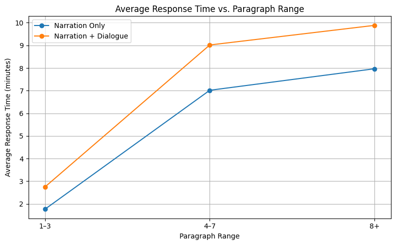

# 🎧 Story2Audio

**Story2Audio** is a multi-modal AI storytelling system that takes a short prompt and generates a complete narrated story with expressive emotional audio. It uses a custom gRPC backend powered by LLaMA3 (via Ollama), XTTS (voice cloning), and Streamlit or REST clients to provide a responsive and flexible frontend experience.

---

## 🧠 Architecture

```
User (Streamlit or REST)
        │
        ▼
┌─────────────────────────────────────────┐
│         gRPC Server                     │
│  ┌─────────────────────────┐            │
│  │ - Story prompt + meta   │            │
│  │ - LLaMA3/Mistral LLM    │            │
│  │ - XTTS for voice TTS    │            │
│  └─────────────────────────┘            │
└─────────────────────────────────────────┘
        │
        ▼
🎧 Audio Output + 📜 Story Text
```

---

## ⚙️ Set Up Environment

```bash
# 1. Clone the repository
git clone https://github.com/yourusername/story2audio.git
cd story2audio

# 2. Create a virtual environment
python -m venv venv
source venv/bin/activate  # On Windows: venv\Scripts\activate

# 3. Install dependencies
pip install -r requirements.txt

# 4. Prepare model directories
mkdir -p output voices xtts_model
```

> ✅ Make sure you have:
>
> * A CUDA-compatible GPU (for XTTS)
> * `ollama` installed and running locally (`ollama pull llama3` and `ollama pull mistral:7b-instruct`)
> * XTTS model files inside `xtts_model/` directory
> * Protocol buffers compiler installed for gRPC

---

## 🚀 Running the Service

### Start the gRPC server
```bash
python server.py
```

### Start the Streamlit frontend
```bash
streamlit run streamlit_ms.py
```

### (Optional) Start the REST proxy server
```bash
python rest_server.py
```
This will start a REST server at `http://localhost:8000/generate-story/`.

---

## 📱 gRPC Interface

### Proto file: `story_service.proto`
```proto
syntax = "proto3";

service StoryService {
  rpc GenerateStory (StoryRequest) returns (StoryResponse);
}

message StoryRequest {
  string prompt = 1;
  string emotion = 2;
  float speed = 3;
  string language = 4;
  string speaker_audio = 5;
  bool include_narration = 6;
}

message StoryResponse {
  bytes audio = 1;
  string text = 2;
  string message = 3;
}
```

---

## ✨ Features

* 📜 **Intelligent Story Generation**: Create compelling stories with LLaMA3 or Mistral based on your prompt and desired length
* 🎭 **Emotional Expression**: Choose from different emotional tones (happy, sad, angry, neutral)
* 🗣️ **Voice Modes**: Select between narration-only or narration + dialogue (with female character voices)
* 🌐 **Multi-language Support**: Generate stories in multiple languages (en, es, fr, de, hi, it, ru)
* 🔊 **Voice Cloning**: Use any voice by uploading a .wav file (≥15s) or recording directly in the app
* ⚡ **Concurrent Processing**: Generate multiple stories simultaneously with real-time progress tracking
* 🎛️ **Customization Options**: Adjust speech speed and story complexity to your preferences

---

## 🗣️ How to Add Custom Voice

In the Streamlit interface:
1. Upload a `.wav` file (minimum 15 seconds)
2. OR record your voice using the built-in microphone recorder
3. Provide a unique speaker name
4. Your voice will appear in the dropdown menu for future story generation

All voices are saved under the `voices/` folder and indexed in `speakers.json`.

---

## 🌐 REST API Usage

### Endpoint:
```
POST http://localhost:8000/generate-story/
```

### JSON Payload:
```json
{
  "prompt": "[PARA_LEVEL:1–3] A young girl finds a lost puppy in the rain.",
  "emotion": "happy",
  "speed": 1.0,
  "language": "en",
  "include_narration": true,
  "speaker_audio_base64": "Uk1GR..."
}
```

### Response:
```json
{
  "text": "Generated story text...",
  "message": "success",
  "audio_file": "response_audio.wav"
}
```

---

## 🧪 Test Case Format & Automation

Sample test case format (`TestCases.json`):
```json
[
  {
    "prompt": "[PARA_LEVEL:1–3] A young girl finds a lost puppy in the rain.",
    "emotion": "happy",
    "speed": 1.0,
    "language": "en",
    "include_narration": true,
    "speaker_audio_base64": "Uk1GR..."
  }
]
```

You can use this with `rest_server.py` to send batches of test prompts to the gRPC server via REST.

---

## 📊 Performance Evaluation

The graph below shows the average response time based on story length and voice mode:




| Paragraph Range | Narration Only | Narration + Dialogue |
|-----------------|---------------:|---------------------:|
| 1-3 paragraphs  | ~1.8 minutes   | ~2.8 minutes         |
| 4-7 paragraphs  | ~7.0 minutes   | ~9.0 minutes         |
| 8+ paragraphs   | ~8.0 minutes   | ~9.9 minutes         |

Key observations:
- Narration + Dialogue mode takes approximately 20-30% longer than Narration Only
- Processing time increases significantly between short (1-3) and medium (4-7) stories
- Response times are based on a system with NVIDIA RTX 3050 GPU

---

> ℹ️ **Tips for Best Results**:  
> * Prompt must be in English — this works best for generating English audio stories  
> * Use specific, emotionally rich story prompts  
> * Choose a voice and emotion that match your story theme  
> * For longer stories, use `[PARA_LEVEL:8+]` in your prompt  
> * High-quality speaker audio (clear, minimal background noise) improves speaker cloning  
> * Longer paragraph levels take more time to process; shorter ones are faster  
> * Ensure GPU is enabled for faster processing


## 👥 Contributors
- Hasnain Ibrar Butt (https://github.com/Hasnain2430))
- Abdullah Bin Umar (https://github.com/ABDULLAHUMAR020703)

